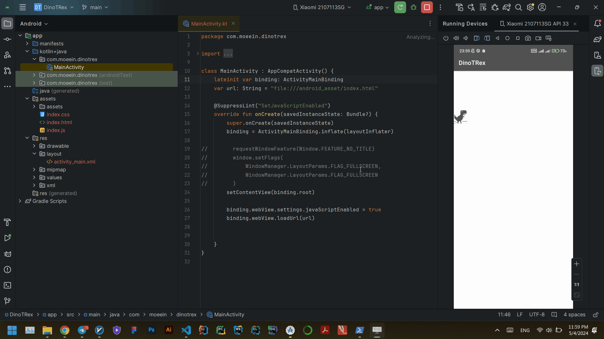

# Android Chrome Dino

An Android version of the classic Chrome Dino game written in Kotlin and XML. This project aims to replicate the simple yet addictive gameplay of the original Chrome Dino game, allowing users to enjoy the experience on their Android devices.

<p align="center">
  
</p>


## Features

- Faithful recreation of the Chrome Dino game.
- Simple and intuitive controls.
- Endless gameplay for endless fun.
- Score tracking to challenge yourself and friends.

## Requirements

- Android device running Android 4.4 (KitKat) or higher.
- Kotlin-compatible IDE (e.g., Android Studio).

## Installation

1. Clone the repository to your local machine:

```bash
git clone https://github.com/MoeeinAali/Android-Chrome-Dino
```
